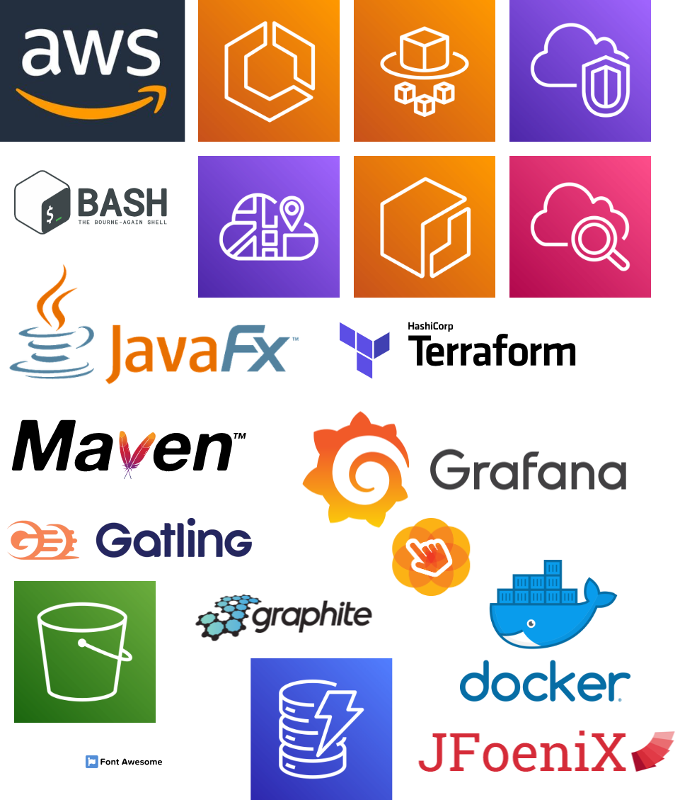
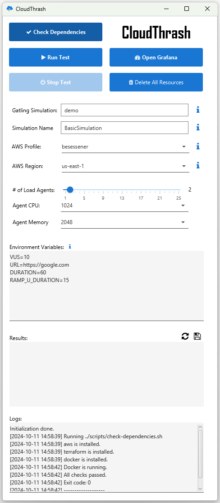
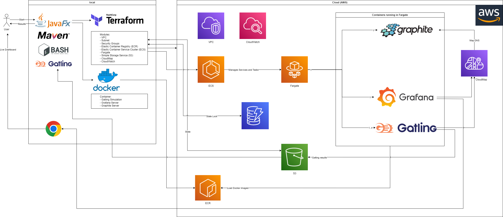

# CloudThrash


**_Thrash your Web-App until it hurts._**

This repository provides a solution for distributed performance testing using Gatling, Graphite, and Grafana with AWS. It leverages Docker for containerized environments and Terraform for infrastructure as code.

## Features

-   **Gatling**: Used for load testing and performance benchmarking.
-   **Graphite**: Time-series database for storing performance metrics.
-   **Grafana**: Visualization tool to create dynamic dashboards for performance monitoring.
-   **Docker**: Containerized environments for easy deployment.
-   **Terraform**: Infrastructure as Code (IaC) to automate the setup of cloud resources.

Technology Map:



## Repository Structure

-   **/**: Contains Dockerfiles for setting up Gatling, Grafana, and Graphite.

    -   `dockerfile.gatling`: Dockerfile for Gatling.
    -   `dockerfile.grafana`: Dockerfile for Grafana.
    -   `dockerfile.graphite`: Dockerfile for Graphite.

-   **docker/**: Contains files copied to docker containers for setting up Gatling, Grafana, and Graphite.

    -   `gatling/`: Scripts related to running and configuring Gatling inside a Docker container.
    -   `grafana/`: Configuration files for Grafana dashboards and data sources.
    -   `graphite/`: Configuration for Graphite.

-   **scripts/**: Shell scripts for managing the testing environment and processes; controlled by the UI and usually not required to be called directly.

    -   `run-test.sh`: Script to deploy Docker containers, create infrastructure, and run the Gatling test. **This is the entry point.** If nothing is running OR if infrastructure is up already, it will trigger a new test.
    -   `stop-test.sh`: Script to stop a test, with user selection from running tests.
    -   `deploy-docker-container.sh`: Script to deploy the Docker containers, done automatically by `run-test.sh` if required.
    -   `list-results.sh`: Script to list the test results.
    -   `variables.sh`: Contains environment variables used across scripts. **This is the place where you need to put your configuration values if you are not using the GUI.**

-   **simulation/**: Contains the Gatling simulation setup. This Gatling simulation is meant as a demo. My recommendation is to use an additional repository for your Gatling simulations, unless you use this entire setup for only one use case. If you want to run different simulations, this demo directory is not suitable anymore. Instead an external Git repository should be referenced. Furthermore the demo simulation can work as an easy way of testing single endpoints by configuring some environment variables (VUS, URL, DURATION).

    -   `src/test/java/simulations/BasicSimulation.java`: Example Gatling simulation.
    -   `pom.xml`: Maven configuration file.

-   **terraform/**: Terraform configurations for setting up cloud infrastructure.
    -   `main.tf`: Main Terraform configuration file.
    -   `modules/`: Contains reusable Terraform modules for ECS, network, and S3 setups.

## Getting Started

### Prerequisites

-   AWS CLI
-   Docker
-   Terraform
-   Bash Shell (Git Bash on Windows is sufficient)
-   AWS credentials in your user home: `~/.aws/credentials` and `~/.aws/config`

### Setup

1. **Clone the Repository**

    ```bash
    git clone git@github.com:besessener/CloudThrash.git
    cd CloudThrash
    ```

2. **Run the GUI**

    Execute `run.sh` in the root to open the GUI. It should be self explanatory with tooltips and stuff.

    

3. **Alternative: Run the Test in your bash**

    The `run-test.sh` script will handle the entire process, including deploying Docker containers, creating the necessary cloud infrastructure with Terraform, and executing the Gatling performance test:

    ```bash
    ./scripts/run-test.sh
    ```

    The script includes the following steps:

    - Creates an ECR and deploys Docker containers for Gatling, Grafana, and Graphite.
    - Initializes and applies Terraform configurations to create the required cloud infrastructure.
    - Runs the Gatling performance test and collects the results.
        - Gatling will run on 2 different Fargate instances: normal task and leader mode
        - normal task (n-1): will just run Gatling
        - leader (1): will run Gatling in the same way, but in the end wait for all tasks to finish and then create an overall report and push it to S3

    **Monitoring**:

    Access Grafana to monitor the test results:

    ```bash
    # Replace with your Grafana URL from the grafana task in ECS
    http://<grafana_url>:3000
    ```

    **Stop the Test**

    When you want to abort a running test, execute the `stop-test.sh` script:

    ```bash
    ./scripts/stop-test.sh
    ```

    **Clean Up**

    After the test is complete, you clean up resources using the `delete-all-resources.sh` script. **Be cautious: this will delete all resources, including the S3 bucket (containing the results) and the ECR registry with the docker images. If you restart your tests you have to upload the docker images again and results are lost forever.**

    The entire setup won't cause much costs. For ECR and S3 you pay per GB, but the results and images don't need much space. ECS itself doesn't cost anything when there are no running tasks. Graphite and Grafana might cause the highest cost as they are constantly running services. CloudMap will cost a bit for using the Graphite DNS. So always consider this.

    ```bash
    ./scripts/delete-all-resources.sh
    ```

## Architecture

This project leverages AWS ECS (Elastic Container Service) with Fargate instances to create load with Gatling (Java).

Architecture Diagram:



It is not meant to be a fully web oriented app. This tool has a local JavaFX interface and shell scripts to trigger load tests inside the cloud and retrieve results after. Locally the configuration is done, docker images are built and cloud infrastructure is created.

It is important to notice, the the entire app works serverless with Fargate instances. The amount of `vCPU` for Fargate is usually restricted and you might need to increase the quota accordin to your needs.

All ECS tasks run within the same VPC. To reach the Graphite server to store and read time series data, a CloudMap DNS is in place. The IP would change on every new deplyoment, so service discovery is required here for other services beeing able to access Graphite.

Graphite and Grafana run as services where both have exactly one task running.

Gatling runs only as tasks. Every time a test starts it will trigger `n-1` normal Gatling tasks and exactly `1` Gatling leader. The leader is responsible for creating the overall report and pushing report details into S3 so that the user and retrieve and analyse them locally again.

## Customization

-   Modify the Gatling simulations in the `simulation/src/test/java/simulations/` directory to fit your testing scenarios (only as long as you have one simulation, more meant as a demo).
-   Update the Grafana dashboards in the `docker/grafana/` directory to customize the performance metrics visualization.

## Contributing

Contributions are welcome! Please open an issue or submit a pull request for any enhancements or bug fixes.

## License

This project is licensed under the MIT License.
